[hitenraju.com](https://hitenraju.com) &nbsp;·&nbsp;
[linkedin](https://linkedin.com/in/hiten-rohra) &nbsp;·&nbsp;
[email](mailto:hraju@usc.edu)

> Software engineer. MS CS at USC, in Los Angeles. 
> I like the part of the problem where the latency budget stops being polite.

Two years shipping production backends — five monoliths pulled apart into 
twelve services, a monitoring platform that a hundred-odd engineers now open 
before they open the logs, 99.9% uptime carried across enterprise accounts. 
At USC through May 2027 for AI/ML and distributed systems, which in practice 
means retrieval pipelines fast enough that nobody notices them.

<samp>python &nbsp; typescript &nbsp; javascript &nbsp; java &nbsp; c++ &nbsp; sql</samp> 
<samp>fastapi &nbsp; node &nbsp; spring boot &nbsp; django &nbsp; grpc &nbsp; graphql</samp> 
<samp>postgres &nbsp; redis &nbsp; kafka &nbsp; dynamodb &nbsp; supabase</samp> 
<samp>aws &nbsp; gcp &nbsp; kubernetes &nbsp; docker &nbsp; terraform</samp> 
<samp>tensorflow &nbsp; langchain &nbsp; rag &nbsp; vector search &nbsp; opencv</samp>

**[DaySays](https://github.com/HitenRohra/DaySays)** &nbsp;·&nbsp; <samp>typescript, rag</samp> 
AI journaling app. A retrieval pipeline held to a sub-100ms p99, which is most 
of why 7-day retention moved 30%. First place at TechWeek, out of 40+ teams.

**[AI_Interview](https://github.com/HitenRohra/AI_Interview)** &nbsp;·&nbsp; <samp>python, rag</samp> 
Automated screening: reads the résumé, asks questions that follow from it, 
scores the answers. 35% better answer precision and 60% fewer hallucinations 
than the first cut, with latency taken from 4.2s down to 1.1s.

**[AnomalyDetector](https://github.com/HitenRohra/AnomalyDetector)** &nbsp;·&nbsp; <samp>python, opencv</samp> 
Spots explosions, accidents and theft in video footage. 90%+ accuracy at 
24 FPS on 45% less compute, which is what made it deployable at the edge. 
Published at IRCICD'23.

**[AI_Coding_Assistant](https://github.com/HitenRohra/AI_Coding_Assistant)** &nbsp;·&nbsp; <samp>python</samp> 
A Cursor-shaped coding assistant that never leaves the terminal.

